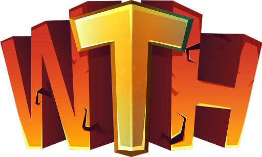

    <h1>
        
         
        Welcome To Hell Kit 
    </h1>
    

        Everything you need to build towers for Welcome To Hell.
         
        <a href="https://kit.welcomestohell.com/">kit.welcomestohell.com</a>
    

## License

Copyright (c) 2024-2026 Team Fireworks Games

This program is free software: you can redistribute it and/or modify
it under the terms of the GNU General Public License as published by
the Free Software Foundation, either version 3 of the License, or
(at your option) any later version.

This program is distributed in the hope that it will be useful,
but WITHOUT ANY WARRANTY; without even the implied warranty of
MERCHANTABILITY or FITNESS FOR A PARTICULAR PURPOSE.  See the
GNU General Public License for more details.

You should have received a copy of the GNU General Public License
along with this program.  If not, see <https://www.gnu.org/licenses/>.

The license in this repository only covers the code and algorithims in this
repository. Non-code assets including but not limited to assets, trademarks,
sound files, and music are explicitly not covered under the license.
